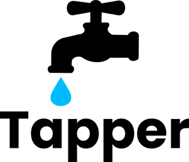
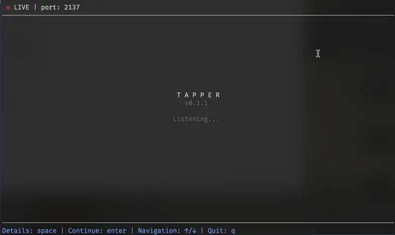

<p align="center">
    

</p>
<p align="center">
    <a href="https://github.com/tapperphp/tapper/actions"></a>
    
</p>

```PHP
<?php

tp('👋 Hello, this is Tapper');
tp('A tiny debugger for PHP');
tp('You can send debug messages, just like console.log in JS');

tp('It can also send structured data:');
tp(['fruits' => ['apple', 'banana', 'pineapple']]);

tp('Or even very long structured data');
tp(['fruits' => ['apple', 'banana', 'pineapple', 'orange', 'strawberry', 'blueberry', 'pear'], 'accounts' => [['name' => 'Alice', 'email' => 'alice@ec.net', 'subscribe' => false, 'age' => 26], ['name' => 'John', 'email' => 'john@ec.net', 'subscribe' => true, 'age' => 21], ['name' => 'Jane', 'email' => 'jane@ec.net', 'subscribe' => true, 'age' => 31]]]);

tp('You can pause code execution...');
foreach (range(1, 3) as $i) {
    tp("Paused in loop at iteration $i")->wait();
    tp('That will run after wait');
}
```

👇👇👇👇👇👇👇👇👇👇👇



## 🚧 Project Status

This project is in active development and not yet ready for production use.  
Expect breaking changes before v1.0 is released.
